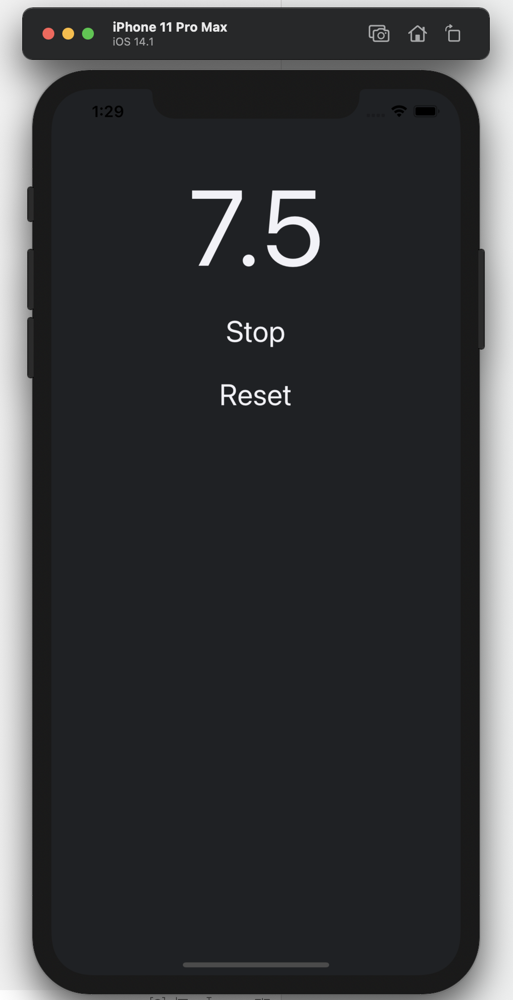

# OVERVIEW

This is an idea of a Stop Watch project using Swift. It is really basic and it was the first time in contact with Swift.
Two buttons/three options to make it work. Start/Pause and Reset.

## Development Environment

* XCode 12
* Swift
* Macbook Pro

## Execution

It is required to have a machine running MacOS and install XCode. While running the project in XCode, select the type of iPhone you would like
to emulate and use the app. The app will start running the watch after touching the "start" button and make the "start" button
becomes a "pause" button that makes the watch pause if touched. The "reset" button is to make the watch starts from 0 again.

